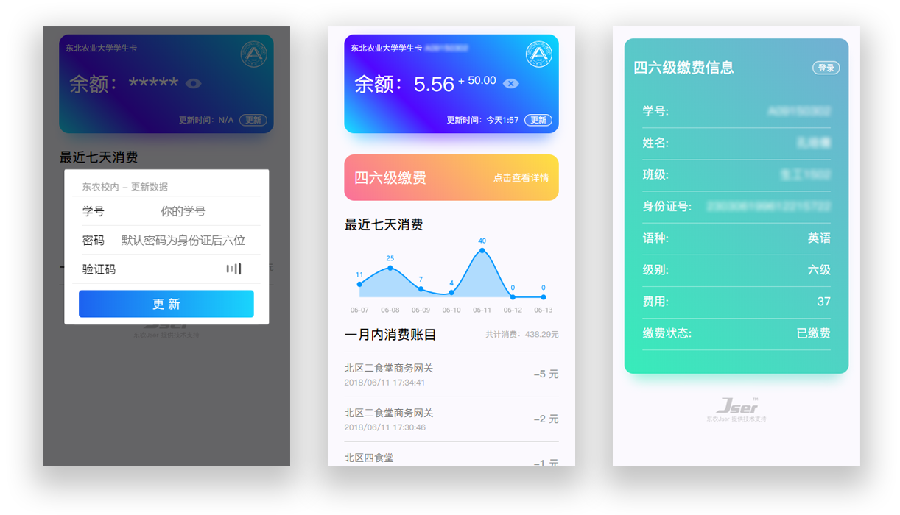

# 东北农业大学校园卡信息查询平台

> &#x1F393; [东北农业大学(以下简称为NEAU)官方校园卡信息查询平台](http://card.neau.edu.cn)（只能使用校园网打开）

**项目预览地址：&#x1F449;** [https://card.xiaonei.io](https://card.xiaonei.io)

&#x1F625;鉴于NEAU官方校园卡查询系统只能在校园网内网中使用，并且没有移动端  
&#x1F4A1;为了方便同学们随时查询校园卡余额和流水信息，以及进行四六级一键缴费  
&#x1F4AA;我基于Egg.js、axios、cheerio、MongoDB编写了校园卡信息的爬虫、数据后台及API接口，基于Vue.js、Vux、Vue Router以及ECharts对前端界面进行了设计编写

搭建出了如下所示的校园卡信息查询平台&#x1F308;：



> &#x26A0; Tips：四六级一键缴费功能仅在四六级考试报名期间开启，其他时间入口作隐藏

## 克隆/开发

```shell
# 克隆代码
git clone https://github.com/BlueSky1997AL/neau-card.git
```

```shell
# 目录结构
. neau-card
├── asset       # README.md中用到的图像资源
├── backend     # 后端项目
├── webdev      # 前端项目
├── .gitignore  # git 忽略列表
└── README.md   # 本说明文件
```

> &#x26A0; Tips：更多详细项目介绍/开发信息请移步  
  　　　　[前端项目](https://github.com/BlueSky1997AL/neau-card/tree/master/webdev) | [后端项目](https://github.com/BlueSky1997AL/neau-card/tree/master/backend)

